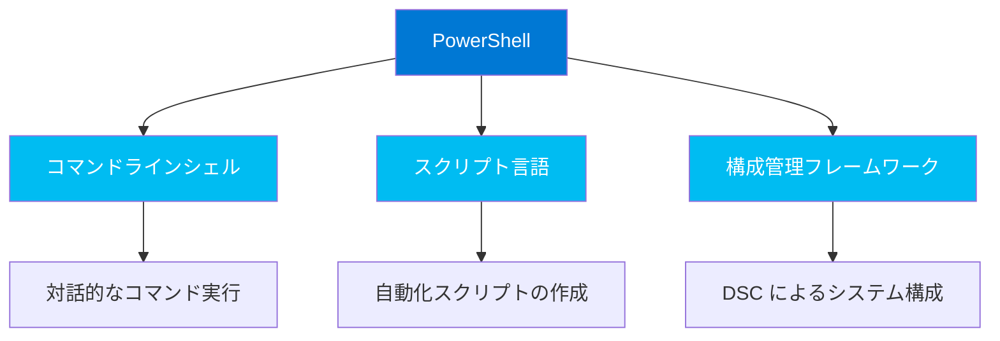
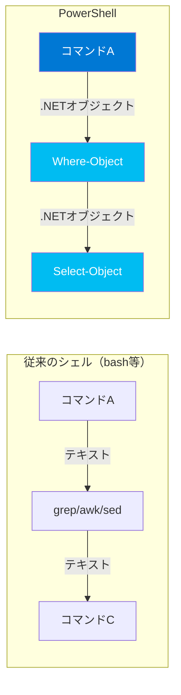

## PowerShellの定義

PowerShellは、Microsoftが開発した**クロスプラットフォーム対応のタスク自動化ソリューション**です。単なるコマンドラインシェルではなく、以下の3つの要素を統合した総合的なプラットフォームです。



## 歴史: Monad Manifesto から PowerShell 7 へ

PowerShellの起源は、2002年にMicrosoftのJeffrey Snoverが発表した **「Monad Manifesto」** にまで遡ります。これは、Windowsの管理を根本的に改革するビジョンを描いた文書です。

### 年表

| 年 | 出来事 |
|---|---|
| **2002** | Jeffrey Snoverが「Monad Manifesto」を発表 |
| **2006** | Windows PowerShell 1.0 リリース |
| **2009** | Windows PowerShell 2.0（リモート処理・ISE・モジュール対応） |
| **2012** | Windows PowerShell 3.0（ワークフロー・CIM対応） |
| **2014** | Windows PowerShell 5.0（クラス構文・DSC強化） |
| **2016** | **PowerShell Core 6.0**（.NET Core ベース・オープンソース化・クロスプラットフォーム対応） |
| **2020** | **PowerShell 7.0**（.NET 5統合・Windows PowerShell互換性向上） |
| **2024–** | PowerShell 7.4/7.5（継続的な機能強化・パフォーマンス改善） |

### Monad Manifesto の核心思想

Jeffrey Snoverが提唱した設計思想は、今日のPowerShellの根幹をなしています：

1. **「管理者はプログラマーではない」** — しかし自動化の力は必要
2. **コマンドの出力はテキストではなくオブジェクト** — 構造化データを直接操作
3. **一貫した名前付け規則** — `Verb-Noun` パターンで覚えやすく
4. **パイプラインでコマンドを組み合わせる** — Unixの思想をオブジェクトで昇華

## Windows PowerShell vs PowerShell 7

現在、PowerShellには2つの系統があります：

| 特徴 | Windows PowerShell | PowerShell 7+ |
|---|---|---|
| **バージョン** | 5.1（最終版） | 7.x（アクティブ開発中） |
| **ランタイム** | .NET Framework | .NET (Core) |
| **プラットフォーム** | Windowsのみ | Windows / macOS / Linux |
| **実行ファイル** | `powershell.exe` | `pwsh` (`pwsh.exe`) |
| **エディション** | Desktop | Core |
| **並行インストール** | — | Windows PowerShellと共存可能 |
| **ステータス** | メンテナンスモード | アクティブ開発 |

> **重要:** Windows 10/11にはWindows PowerShell 5.1がプリインストールされていますが、**新規学習はPowerShell 7+を推奨**します。本講義もPowerShell 7を前提として進めます。

## PowerShellの3つの柱

### 1. コマンドラインシェル

PowerShellは、従来のコマンドプロンプト（cmd.exe）やbashシェルに相当する**対話型シェル**として機能します。

主な特徴：
- **コマンド履歴**の保持とセッション間での共有
- **タブ補完**とコマンド予測（PSReadLine）
- **エイリアス**による短縮コマンド
- 統合的な**ヘルプシステム**

### 2. スクリプト言語

PowerShellは完全なスクリプト言語としての機能を備えています：

- **変数**、**配列**、**ハッシュテーブル**
- **条件分岐**（`if`/`switch`）と**ループ**（`for`/`foreach`/`while`）
- **関数**と**クラス**の定義
- **例外処理**（`try`/`catch`/`finally`）
- **モジュール**によるコードの再利用

### 3. 構成管理フレームワーク

**Desired State Configuration（DSC）** を通じて、システムの「あるべき状態」を宣言的に定義し、自動的にその状態を維持できます。

## PowerShellが他のシェルと決定的に異なる点

PowerShellの最大の特徴は **「オブジェクトパイプライン」** です。



### テキスト vs オブジェクト — 具体例

例えば、「メモリ使用量が100MB以上のプロセスを取得する」場合：

**bash の場合:**
```bash
# テキストを列で切り出す必要がある
ps aux | awk '{if ($6 > 102400) print $0}'
```

**PowerShell の場合:**
```powershell
# オブジェクトのプロパティに直接アクセス
Get-Process | Where-Object { $_.WorkingSet64 -gt 100MB }
```

PowerShellでは、`Get-Process` が返すのはテキストではなく **`System.Diagnostics.Process` オブジェクト**です。各プロセスの `WorkingSet64`（メモリ使用量）プロパティに直接数値比較でアクセスできます。テキストのパース（解析）は不要です。

## .NET との統合

PowerShellは **.NET ランタイム**上で動作するため、.NETの全機能にアクセスできます：

```powershell
# .NET のクラスを直接利用
[System.Math]::PI                          # 3.14159265358979
[System.DateTime]::Now                     # 現在日時
[System.IO.Path]::GetExtension("test.ps1") # .ps1
[System.Net.Dns]::GetHostName()            # ホスト名

# .NET のメソッドをオブジェクトに対して呼び出し
"Hello, PowerShell".ToUpper()              # HELLO, POWERSHELL
(Get-Date).AddDays(-7)                     # 7日前の日時
```

## まとめ

| ポイント | 内容 |
|---|---|
| PowerShellとは | シェル + スクリプト言語 + 構成管理の統合ソリューション |
| 設計思想 | Monad Manifesto に基づくオブジェクト指向自動化 |
| 推奨バージョン | PowerShell 7+（クロスプラットフォーム・アクティブ開発） |
| 最大の特徴 | オブジェクトパイプライン（テキストではなくオブジェクトが流れる） |
| .NET統合 | .NETのクラスやメソッドを直接利用可能 |

## ハンズオン課題

ターミナルで以下を実行して、PowerShellの基本情報を確認してみましょう：

```powershell
# 1. PowerShellのバージョン情報を確認
$PSVersionTable

# 2. エディションを確認（Core であることを確認）
$PSVersionTable.PSEdition

# 3. .NET ランタイムのバージョン
[System.Runtime.InteropServices.RuntimeInformation]::FrameworkDescription

# 4. 利用可能なコマンドレットの総数を確認
(Get-Command -CommandType Cmdlet).Count
```
