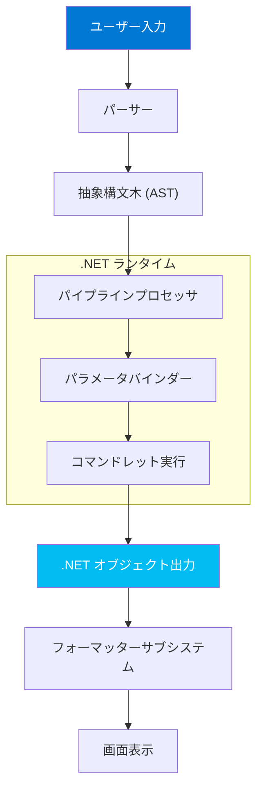
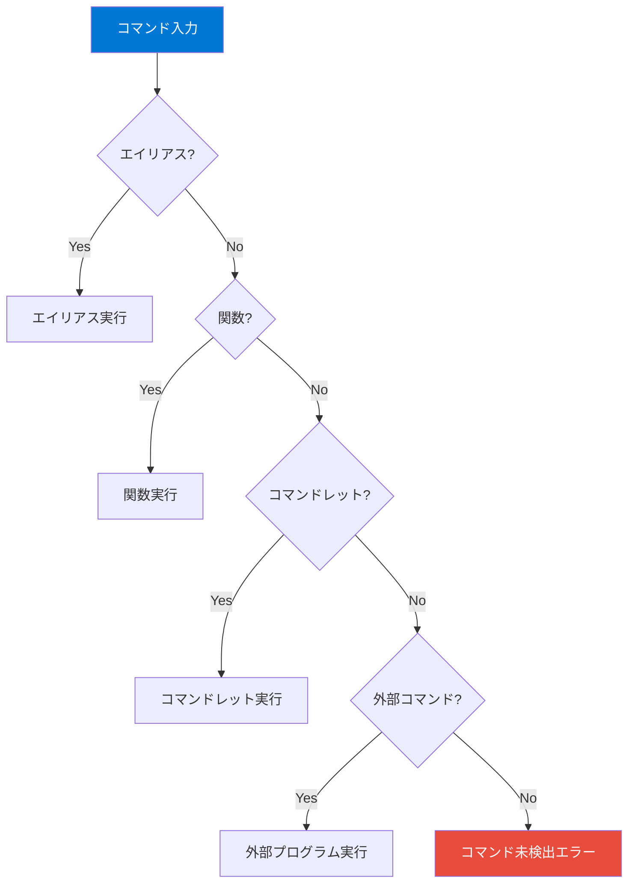
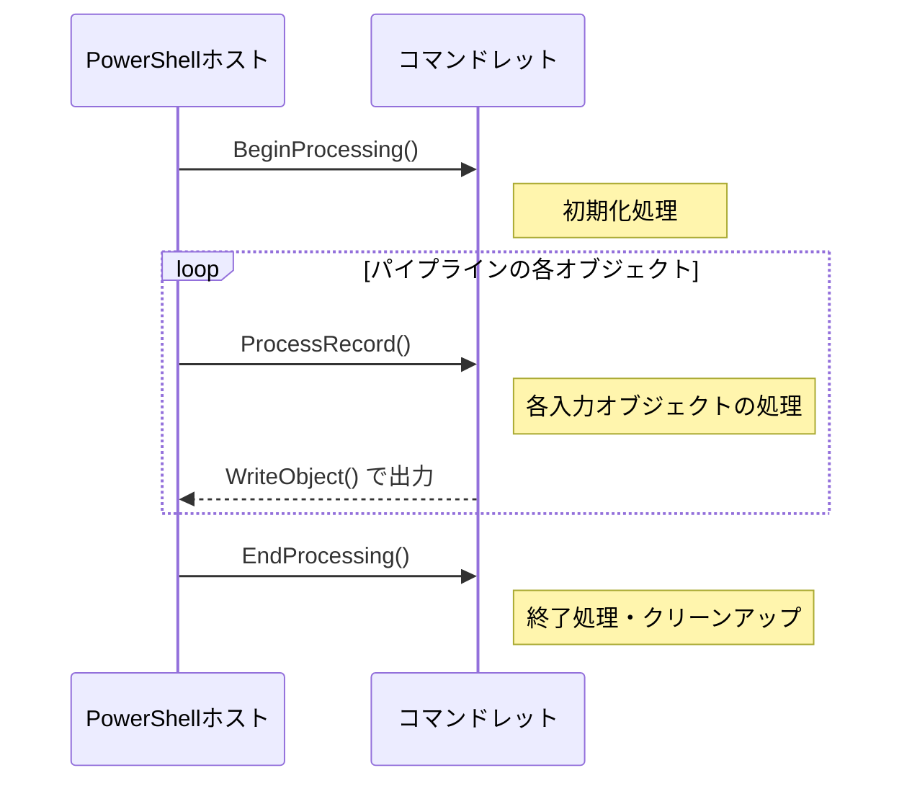
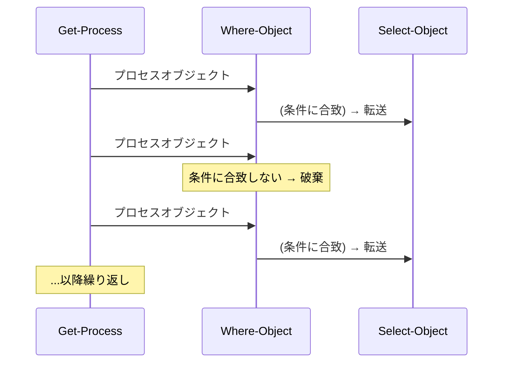

## PowerShellの内部構造

PowerShellがコマンドを処理する仕組みを理解することで、より効果的にシェルを活用できるようになります。



## コマンドの分類と解決順序

PowerShellでコマンドを入力すると、以下の優先順位で解決されます：



| 優先順位 | 種類 | 説明 | 例 |
|:---:|---|---|---|
| 1 | **エイリアス** | コマンドの短縮名 | `ls` → `Get-ChildItem` |
| 2 | **関数** | PowerShellで定義された関数 | `function Hello { ... }` |
| 3 | **コマンドレット** | .NETクラスとして実装されたコマンド | `Get-Process` |
| 4 | **外部コマンド** | OS上の実行ファイル | `git`, `curl`, `ping` |

### 確認方法

```powershell
# コマンドの種類を確認
Get-Command ls
# CommandType: Alias

Get-Command Get-Process
# CommandType: Cmdlet

Get-Command git
# CommandType: Application

# 同名コマンドの全候補を確認
Get-Command -Name ping -All
```

## コマンドレットの構造

コマンドレットは **.NETのクラス**として実装されており、以下のライフサイクルで実行されます：



PowerShellの関数で `Begin`/`Process`/`End` ブロックを使うのは、このコマンドレットの内部構造を反映しています。この仕組みは第7章で詳しく学びます。

## Verb-Noun 命名規則

PowerShellのコマンドレットは `動詞-名詞` の形式で統一されています。これにより、コマンドの機能を名前から推測できます。

### 標準動詞（主要なもの）

| カテゴリ | 動詞 | 意味 | 例 |
|---|---|---|---|
| **データ取得** | `Get` | 取得する | `Get-Process`, `Get-ChildItem` |
| **データ変更** | `Set` | 設定する | `Set-Location`, `Set-Content` |
| **作成** | `New` | 新規作成 | `New-Item`, `New-Object` |
| **削除** | `Remove` | 削除する | `Remove-Item`, `Remove-Variable` |
| **開始** | `Start` | 開始する | `Start-Process`, `Start-Service` |
| **停止** | `Stop` | 停止する | `Stop-Process`, `Stop-Service` |
| **検索** | `Find` | 検索する | `Find-Module`, `Find-Package` |
| **テスト** | `Test` | 条件テスト | `Test-Path`, `Test-Connection` |
| **変換** | `Convert` | 変換する | `ConvertTo-Json`, `ConvertFrom-Csv` |
| **出力** | `Out` | 出力先指定 | `Out-File`, `Out-Null` |
| **書き出し** | `Write` | データ出力 | `Write-Host`, `Write-Output` |
| **読み込み** | `Read` | 入力読取 | `Read-Host` |
| **呼び出し** | `Invoke` | 実行する | `Invoke-Command`, `Invoke-WebRequest` |
| **選択** | `Select` | 選択する | `Select-Object`, `Select-String` |

```powershell
# 承認済み動詞の一覧を確認
Get-Verb

# 特定カテゴリの動詞だけ表示
Get-Verb -Group Common
Get-Verb -Group Data
Get-Verb -Group Lifecycle
```

## PowerShellホスト

PowerShellの「ホスト」とは、PowerShellエンジンを利用するアプリケーションのことです。

| ホスト | 説明 |
|---|---|
| `ConsoleHost` | ターミナルで `pwsh` を起動したときの標準ホスト |
| VS Code 統合ターミナル | VS CodeのPowerShell拡張機能が提供するホスト |
| PowerShell ISE | Windows専用の統合開発環境（レガシー） |

```powershell
# 現在のホスト情報を確認
$Host
$Host.Name        # ホスト名
$Host.Version     # ホストのバージョン
```

## パイプラインの内部動作

PowerShellのパイプラインは**ストリーミング処理**です。コマンドAの全出力を待ってからコマンドBに渡すのではなく、**1オブジェクトずつ逐次的に処理**されます。



この**ストリーミング方式**により：
- **メモリ効率が良い** — 全データをメモリに保持する必要がない
- **結果が素早く表示される** — 最初の結果はすぐに画面に出る
- **大量データも処理可能** — 10万件のデータでもメモリを圧迫しない

## 出力ストリーム

PowerShellには**6種類の出力ストリーム**があり、それぞれ異なる目的で使われます：

| ストリーム番号 | 名前 | コマンドレット | 用途 |
|:---:|---|---|---|
| 1 | **Success** | `Write-Output` | 通常の出力（パイプラインに流れる） |
| 2 | **Error** | `Write-Error` | エラーメッセージ |
| 3 | **Warning** | `Write-Warning` | 警告メッセージ |
| 4 | **Verbose** | `Write-Verbose` | 詳細な処理情報 |
| 5 | **Debug** | `Write-Debug` | デバッグ情報 |
| 6 | **Information** | `Write-Information` | 情報メッセージ |

```powershell
# 各ストリームの出力例
Write-Output "通常の出力"       # ストリーム 1（パイプラインに流れる）
Write-Error "エラーです"        # ストリーム 2（赤色で表示）
Write-Warning "警告です"        # ストリーム 3（黄色で表示）
Write-Verbose "詳細情報" -Verbose  # ストリーム 4
Write-Debug "デバッグ情報" -Debug  # ストリーム 5

# ストリームのリダイレクト
Get-Process 2>&1  # エラーストリームを成功ストリームにマージ
Get-Process *>&1  # 全ストリームを成功ストリームにマージ
```

## まとめ

| ポイント | 内容 |
|---|---|
| コマンド解決順序 | エイリアス → 関数 → コマンドレット → 外部コマンド |
| コマンドレット構造 | .NETクラスとして実装、BeginProcessing/ProcessRecord/EndProcessing |
| 命名規則 | `Verb-Noun` 形式で一貫性を確保 |
| パイプライン | ストリーミング処理（1オブジェクトずつ逐次処理） |
| 出力ストリーム | 6種類（Success/Error/Warning/Verbose/Debug/Information） |

## ハンズオン課題

```powershell
# 1. コマンドの種類を調べてみましょう
Get-Command ls         # エイリアス
Get-Command Get-Help   # コマンドレット
Get-Command pwsh       # アプリケーション

# 2. 承認済み動詞を「Common」「Data」カテゴリで表示
Get-Verb -Group Common
Get-Verb -Group Data

# 3. 現在のPowerShellホスト情報を確認
$Host | Format-List *

# 4. 利用可能なエイリアスの総数を確認
(Get-Alias).Count
```

---

## 🌙 寝る前チートシート

> **第1章の要点を3分で復習**

| 概念 | ポイント |
|---|---|
| PowerShellとは | .NET上に構築された**オブジェクト指向**の自動化シェル |
| 3つの顔 | ①コマンドラインシェル ②スクリプト言語 ③構成管理フレームワーク |
| Win PS vs PS7 | Win PS = .NET Framework / 5.1で終了。PS7 = .NET Core / クロスプラットフォーム |
| Verb-Noun | `Get-Process`、`Set-Location` のように「動詞-名詞」で命名 |
| オブジェクトパイプライン | テキストではなく**.NETオブジェクト**がパイプを流れる |
| コマンドの種類 | Cmdlet / Function / Alias / Application |
| ホスト | ConsoleHost（ターミナル）、VS Code 統合ターミナル |

```powershell
# 覚えるべきコマンド
$PSVersionTable         # バージョン確認
$PSVersionTable.PSEdition  # Core or Desktop
pwsh                    # PowerShell 7の起動コマンド
```
