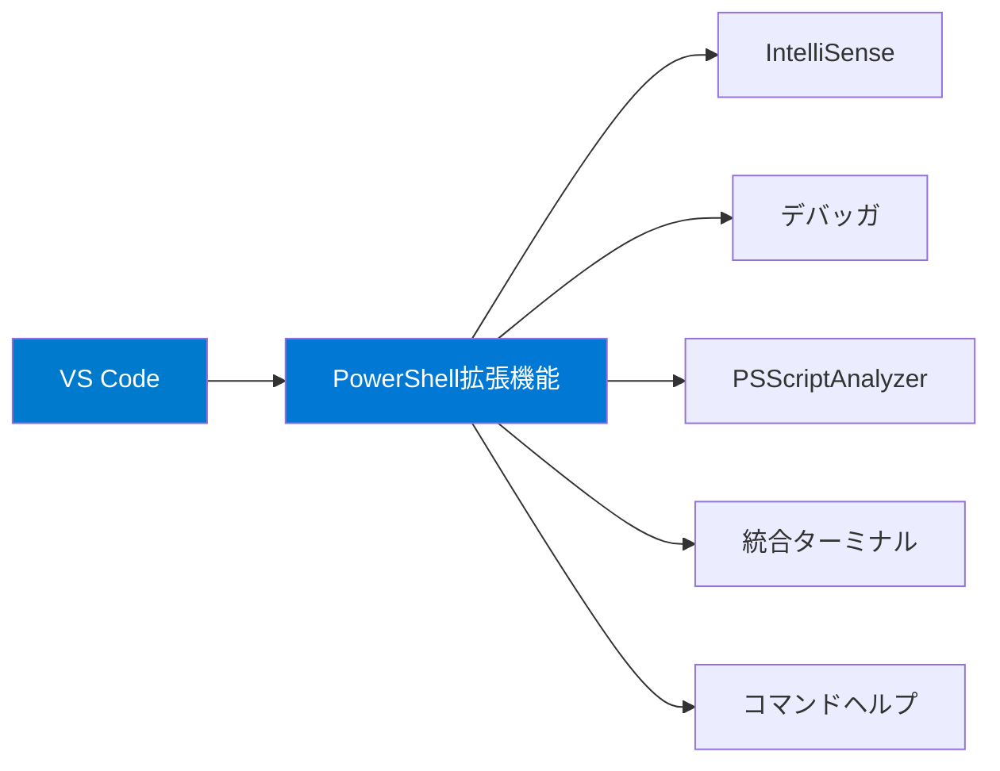

## PowerShell 7 のインストール

### Windows

Windows 10/11にはWindows PowerShell 5.1がプリインストールされていますが、PowerShell 7は**別途インストール**が必要です。両者は共存できます。

```powershell
# 方法1: winget（推奨）
winget install Microsoft.PowerShell

# 方法2: MSIインストーラー
# https://github.com/PowerShell/PowerShell/releases からダウンロード

# 方法3: Microsoft Store
# Microsoft Store で "PowerShell" を検索
```

### macOS

```bash
# Homebrew を使用（推奨）
brew install powershell/tap/powershell

# インストール確認
pwsh --version
```

### Linux（Ubuntu / Debian）

```bash
# Microsoftリポジトリの追加
sudo apt-get update
sudo apt-get install -y wget apt-transport-https software-properties-common

# パッケージソースの登録
source /etc/os-release
wget -q "https://packages.microsoft.com/config/ubuntu/$VERSION_ID/packages-microsoft-prod.deb"
sudo dpkg -i packages-microsoft-prod.deb
rm packages-microsoft-prod.deb

# インストール
sudo apt-get update
sudo apt-get install -y powershell

# 起動
pwsh
```

### Linux（Fedora / RHEL）

```bash
# Microsoftリポジトリの追加
sudo rpm --import https://packages.microsoft.com/keys/microsoft.asc
curl https://packages.microsoft.com/config/rhel/9/prod.repo | sudo tee /etc/yum.repos.d/microsoft.repo

# インストール
sudo dnf install -y powershell

# 起動
pwsh
```

### インストール確認

```powershell
# バージョン確認
pwsh --version
# PowerShell 7.x.x

# 詳細情報
$PSVersionTable
```

## 開発環境のセットアップ

### Visual Studio Code（推奨）

PowerShellの開発環境として **VS Code + PowerShell拡張機能** が最も推奨されます。



**インストール手順:**

1. VS Codeをインストール: https://code.visualstudio.com/
2. 拡張機能タブで「PowerShell」を検索
3. Microsoft公式の **PowerShell** 拡張機能をインストール

**主な機能:**
- **IntelliSense** — コマンドレット名、パラメータ、変数の自動補完
- **統合デバッガ** — ブレークポイント、ステップ実行、変数ウォッチ
- **PSScriptAnalyzer** — コードの静的解析
- **統合ターミナル** — エディタ内でPowerShellを実行
- **コードナビゲーション** — 定義へのジャンプ、参照検索

### その他のエディタ

| エディタ | 特徴 |
|---|---|
| **Neovim** | `powershell.nvim` プラグインで対応。軽量で高速 |
| **PowerShell ISE** | Windows専用。レガシーだが手軽に使える。PowerShell 5.1のみ対応 |
| **Windows Terminal** | シェルを直接使う場合に推奨。タブ・プロファイル機能 |

## プロファイル設定

PowerShellプロファイルは、PowerShell起動時に自動実行されるスクリプトファイルです。エイリアス、関数、環境変数のカスタマイズに使います。

### プロファイルの種類

```powershell
# 現在のユーザー、現在のホスト用プロファイルのパスを確認
$PROFILE

# 全プロファイルパスを確認
$PROFILE | Select-Object *
```

| プロファイル | 対象 | パス（例） |
|---|---|---|
| `CurrentUserCurrentHost` | 現在のユーザー・現在のホスト | `~/.config/powershell/Microsoft.PowerShell_profile.ps1` |
| `CurrentUserAllHosts` | 現在のユーザー・全ホスト | `~/.config/powershell/profile.ps1` |
| `AllUsersCurrentHost` | 全ユーザー・現在のホスト | 管理者権限で設定 |
| `AllUsersAllHosts` | 全ユーザー・全ホスト | 管理者権限で設定 |

### プロファイルの作成・編集

```powershell
# プロファイルが存在するか確認
Test-Path $PROFILE

# プロファイルが存在しない場合は作成
if (-not (Test-Path $PROFILE)) {
    New-Item -Path $PROFILE -ItemType File -Force
}

# プロファイルを開いて編集
code $PROFILE    # VS Codeで開く
notepad $PROFILE # メモ帳で開く（Windows）
```

### プロファイルの例

```powershell
# ~/.config/powershell/Microsoft.PowerShell_profile.ps1

# --- エイリアスの設定 ---
Set-Alias -Name ll -Value Get-ChildItem
Set-Alias -Name g -Value git

# --- カスタム関数 ---
function which ($command) {
    Get-Command $command -ErrorAction SilentlyContinue |
        Select-Object -ExpandProperty Source
}

function mkcd ($dir) {
    New-Item -ItemType Directory -Path $dir -Force
    Set-Location $dir
}

# --- プロンプトのカスタマイズ ---
function prompt {
    $location = Get-Location
    "PS $location> "
}

# --- 起動メッセージ ---
Write-Host "PowerShell $($PSVersionTable.PSVersion) ready!" -ForegroundColor Cyan
```

## 実行ポリシー

PowerShellにはスクリプトの実行を制御する **実行ポリシー** があります。

| ポリシー | 説明 |
|---|---|
| `Restricted` | スクリプト実行不可（Windowsのデフォルト） |
| `AllSigned` | 署名済みスクリプトのみ実行可 |
| `RemoteSigned` | ローカルスクリプトは制限なし、リモートは署名必要 |
| `Unrestricted` | 全スクリプト実行可（警告あり） |
| `Bypass` | 全スクリプト実行可（警告なし） |

```powershell
# 現在の実行ポリシーを確認
Get-ExecutionPolicy

# スコープごとの設定を確認
Get-ExecutionPolicy -List

# 実行ポリシーの変更（管理者権限が必要な場合あり）
Set-ExecutionPolicy -ExecutionPolicy RemoteSigned -Scope CurrentUser
```

> **Linux/macOS での実行ポリシー:** Linux/macOSではデフォルトで `Unrestricted` です。基本的に変更の必要はありません。

## まとめ

| ポイント | 内容 |
|---|---|
| 推奨インストール方法 | Windows: `winget`, macOS: `brew`, Linux: MS公式リポジトリ |
| 推奨エディタ | VS Code + PowerShell拡張機能 |
| プロファイル | `$PROFILE` で起動時スクリプトをカスタマイズ |
| 実行ポリシー | `RemoteSigned` を推奨（ローカルスクリプト実行可） |

## ハンズオン課題

```powershell
# 1. PowerShellバージョンと全詳細情報を確認
$PSVersionTable

# 2. プロファイルのパスを確認し、ファイルが存在するかテスト
$PROFILE
Test-Path $PROFILE

# 3. 実行ポリシーを確認
Get-ExecutionPolicy -List

# 4. プロファイルを作成して、カスタムエイリアスを追加
if (-not (Test-Path $PROFILE)) {
    New-Item -Path $PROFILE -ItemType File -Force
}
Add-Content -Path $PROFILE -Value 'Set-Alias -Name ll -Value Get-ChildItem'

# 5. プロファイルを再読み込み
. $PROFILE
```
