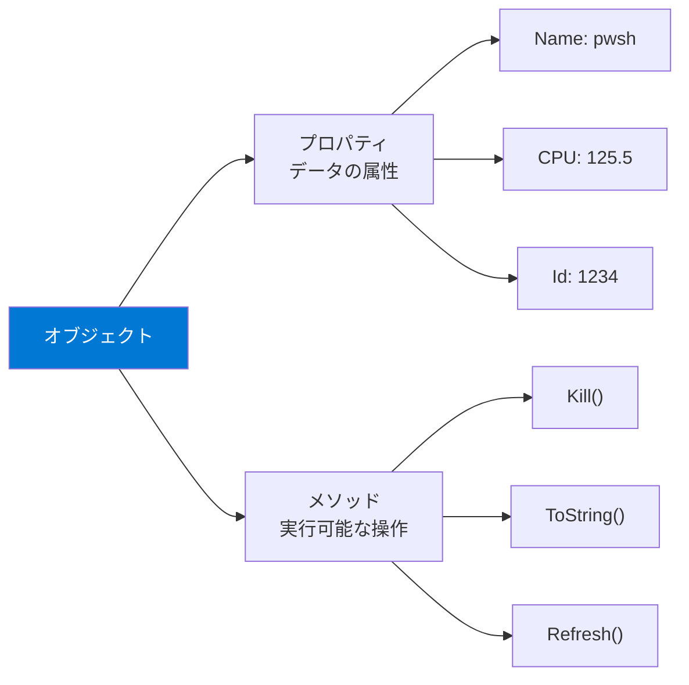
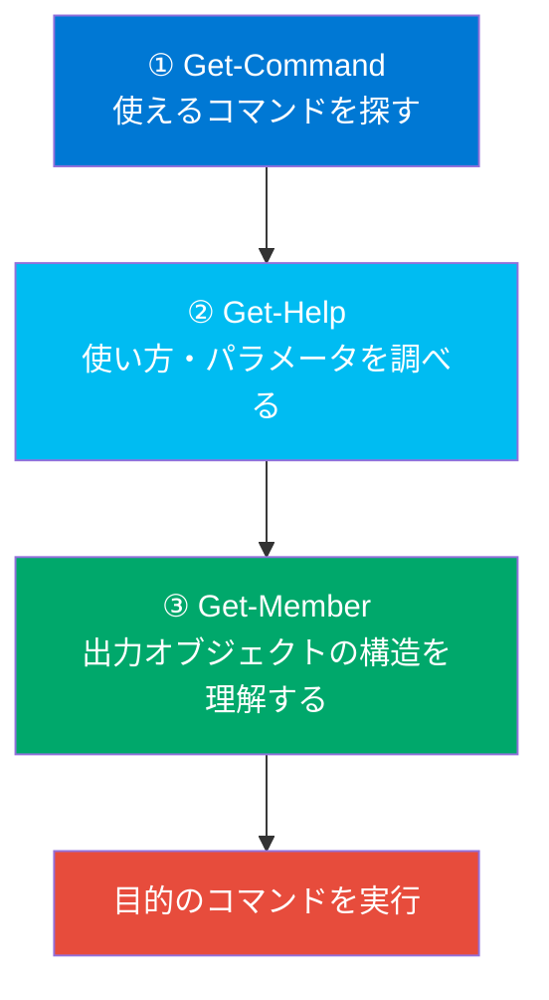

## Get-Command — コマンドの探索

`Get-Command` は、PowerShellで利用可能なコマンドを検索するための必須コマンドレットです。新しいタスクに取り組むとき、まず「どんなコマンドが使えるか」を調べることが第一歩です。

```powershell
# コマンドレットの総数を確認
(Get-Command -CommandType Cmdlet).Count

# 名前でコマンドを検索（ワイルドカード対応）
Get-Command *Process*      # 名前に "Process" を含むコマンド
Get-Command Get-*          # Get で始まるコマンド
Get-Command *-Service      # -Service で終わるコマンド

# 動詞で検索
Get-Command -Verb Get        # Get 動詞のコマンド一覧
Get-Command -Verb Get,Set    # 複数の動詞で検索

# 名詞で検索
Get-Command -Noun Process    # Process 名詞のコマンド一覧
Get-Command -Noun *Item*     # Item を含む名詞

# 特定のモジュールのコマンド一覧
Get-Command -Module Microsoft.PowerShell.Management
Get-Command -Module Microsoft.PowerShell.Utility
```

### コマンドの種類で絞り込み

```powershell
# コマンドレットのみ
Get-Command -CommandType Cmdlet

# 関数のみ
Get-Command -CommandType Function

# エイリアスのみ
Get-Command -CommandType Alias

# 外部アプリケーションのみ
Get-Command -CommandType Application

# 全種類
Get-Command -CommandType All
```

## Get-Help — ヘルプシステム

`Get-Help` は、コマンドの使い方を調べるためのコマンドレットです。PowerShellの学習において**最も重要なコマンド**と言っても過言ではありません。

```powershell
# 基本的なヘルプの表示
Get-Help Get-Process

# 詳細ヘルプ（パラメータの説明含む）
Get-Help Get-Process -Detailed

# 完全なヘルプ（全情報）
Get-Help Get-Process -Full

# 使用例のみ表示
Get-Help Get-Process -Examples

# オンラインヘルプ（ブラウザで開く）
Get-Help Get-Process -Online

# パラメータの詳細を個別に確認
Get-Help Get-Process -Parameter Name
Get-Help Get-Process -Parameter *   # 全パラメータ
```

### ヘルプの更新

```powershell
# ヘルプファイルのダウンロード・更新（初回は必須）
Update-Help -Force -ErrorAction SilentlyContinue

# 特定モジュールのヘルプのみ更新
Update-Help -Module Microsoft.PowerShell.Management
```

### About ヘルプ — 概念の学習

`about_` で始まるトピックは、PowerShellの概念を解説するヘルプドキュメントです。

```powershell
# about ヘルプのトピック一覧
Get-Help about_*

# 特定トピックの閲覧
Get-Help about_Pipelines
Get-Help about_Operators
Get-Help about_Comparison_Operators
Get-Help about_Regular_Expressions
Get-Help about_For
Get-Help about_Foreach
Get-Help about_Try_Catch_Finally
Get-Help about_Functions
Get-Help about_Scopes
```

> **学習のコツ:** 新しい概念に出会ったら、まず `Get-Help about_<概念名>` を確認する習慣をつけましょう。

## Get-Member — オブジェクトの探索

`Get-Member` は、オブジェクトが持つ**プロパティ**と**メソッド**を調べるコマンドレットです。PowerShellはオブジェクト指向なので、「このオブジェクトで何ができるか」を知ることが重要です。



```powershell
# プロセスオブジェクトのメンバーを確認
Get-Process | Get-Member

# プロパティのみ表示
Get-Process | Get-Member -MemberType Property

# メソッドのみ表示
Get-Process | Get-Member -MemberType Method

# 文字列オブジェクトのメンバー
"Hello" | Get-Member

# 数値オブジェクトのメンバー
42 | Get-Member

# 日付オブジェクトのメンバー
Get-Date | Get-Member
```

### プロパティとメソッドの使い方

```powershell
# プロパティへのアクセス
$proc = Get-Process pwsh
$proc.Name          # プロセス名
$proc.Id            # プロセスID
$proc.CPU           # CPU使用時間
$proc.WorkingSet64  # メモリ使用量（バイト）

# メソッドの呼び出し
$today = Get-Date
$today.ToString("yyyy-MM-dd")    # 日付をフォーマット
$today.AddDays(7)                # 7日後の日付
$today.DayOfWeek                 # 曜日

# 文字列メソッド
"Hello, World".ToUpper()         # HELLO, WORLD
"Hello, World".Contains("World") # True
"Hello, World".Replace("World", "PowerShell")  # Hello, PowerShell
"  spaces  ".Trim()              # "spaces"
```

## 探索の3ステップ

PowerShellで新しいタスクに取り組む際の定番パターンです：



### 実践例: 「ファイル操作をしたい」

```powershell
# Step 1: ファイル関連のコマンドを探す
Get-Command *Item*
# → Get-Item, New-Item, Copy-Item, Remove-Item, ...

# Step 2: Get-ChildItem の使い方を確認
Get-Help Get-ChildItem -Examples

# Step 3: Get-ChildItem の出力オブジェクトを確認
Get-ChildItem | Get-Member
# → Name, Length, LastWriteTime などのプロパティがある

# Step 4: 実際に使う
Get-ChildItem ~ -File | Where-Object { $_.Length -gt 1MB } | Select-Object Name, Length
```

> **補足:** `Get-Service` や `Start-Service` などのサービス系コマンドは **Windows専用** です。Linuxでサービスを管理する場合は `systemctl` コマンドを使用してください。

## Show-Command — GUIでコマンドを構築

`Show-Command` を使うと、**GUIベースのフォーム**でコマンドのパラメータを入力できます（Windows限定）。

```powershell
# GUIフォームでGet-Processのパラメータを入力
Show-Command Get-Process

# コマンドを指定せずに全コマンドから選択
Show-Command
```

## まとめ

| コマンド | 目的 | 覚え方 |
|---|---|---|
| `Get-Command` | コマンドを**探す** | 「何が使える？」 |
| `Get-Help` | 使い方を**学ぶ** | 「どう使う？」 |
| `Get-Member` | オブジェクトを**理解する** | 「何が入ってる？」 |

## ハンズオン課題

```powershell
# 1. ファイル操作に関連するコマンドを探す
Get-Command *Item*
Get-Command -Verb Get -Noun *Item*

# 2. Get-ChildItem のヘルプを確認（例付き）
Get-Help Get-ChildItem -Examples

# 3. ファイルオブジェクトのプロパティを探索
Get-ChildItem ~ | Get-Member -MemberType Property

# 4. 日付オブジェクトで「月」を取得するプロパティを見つけて使う
Get-Date | Get-Member -MemberType Property
(Get-Date).Month
(Get-Date).DayOfYear

# 5. 利用可能な about_ ヘルプトピックの数を数える
(Get-Help about_*).Count
```
