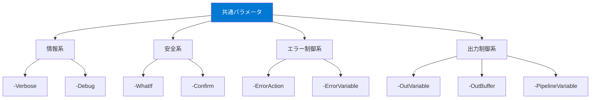

## 共通パラメータとは

PowerShellには、**すべてのコマンドレット**で使用できる共通パラメータが用意されています。スクリプトの安全性向上やデバッグに欠かせない機能です。



## 情報系パラメータ

### -Verbose（詳細表示）

実行中の処理の詳細情報を表示します。「コマンドが何をしているか」を知りたいときに使います。

```powershell
# 詳細情報を表示
Import-Module PSReadLine -Verbose
Copy-Item ./test.txt ./backup/ -Verbose
Get-ChildItem -Recurse -Verbose
```

### -Debug（デバッグ表示）

デバッグレベルの詳細情報を表示し、続行するかどうかの確認プロンプトが表示されます。

```powershell
# デバッグモードで実行
Get-Process -Debug
```

## 安全系パラメータ

### -WhatIf（実行シミュレーション）

**コマンドを実行せずに**、何が起こるかを表示します。破壊的な操作の前に安全確認ができる、非常に重要なパラメータです。

```powershell
# ファイル削除のシミュレーション
Remove-Item ./test.txt -WhatIf
# 出力: What if: Performing the operation "Remove File" on target "test.txt".

# 一括削除のシミュレーション
Get-ChildItem *.log | Remove-Item -WhatIf

# サービス停止のシミュレーション
Stop-Service -Name "wuauserv" -WhatIf
```

### -Confirm（確認プロンプト）

実行前に確認プロンプトを表示します。

```powershell
# 削除前に確認を求める
Remove-Item ./important.txt -Confirm

# 各ファイルごとに確認
Get-ChildItem *.tmp | Remove-Item -Confirm
```

#### $ConfirmPreference

`$ConfirmPreference` 変数で、どのリスクレベルのコマンドに自動的に確認プロンプトを出すかを制御できます。

```powershell
# 現在の設定を確認
$ConfirmPreference  # デフォルトは "High"

# 設定値の意味
# High   - 高リスク操作のみ確認
# Medium - 中・高リスク操作で確認
# Low    - 全操作で確認
# None   - 確認なし
```

## エラー制御系パラメータ

### -ErrorAction（EA）

個々のコマンドでエラーの扱いを制御します。

```powershell
# エラーを無視して続行（メッセージも非表示）
Get-Item "存在しないファイル.txt" -ErrorAction SilentlyContinue

# エラーで即停止（try/catchで捕捉可能にする）
Get-Item "存在しないファイル.txt" -ErrorAction Stop

# エラーメッセージ表示して続行（デフォルト）
Get-Item "存在しないファイル.txt" -ErrorAction Continue

# エラー時にユーザーに確認
Get-Item "存在しないファイル.txt" -ErrorAction Inquire

# エラーを完全に無視（$Errorにも記録しない）
Get-Item "存在しないファイル.txt" -ErrorAction Ignore
```

| 値 | エラー表示 | 実行継続 | $Error記録 |
|---|:---:|:---:|:---:|
| `Continue` | ✅ | ✅ | ✅ |
| `SilentlyContinue` | ❌ | ✅ | ✅ |
| `Stop` | ✅ | ❌ | ✅ |
| `Ignore` | ❌ | ✅ | ❌ |
| `Inquire` | ✅ | ユーザー選択 | ✅ |

### -ErrorVariable（EV）

エラーを指定した変数に格納します。変数名の前に `+` をつけると追記モードになります。

```powershell
# エラーを変数に格納
Get-Item "存在しない1.txt", "存在しない2.txt" -ErrorVariable myErrors -ErrorAction SilentlyContinue

# 格納されたエラーを確認
$myErrors
$myErrors.Count
$myErrors[0].Exception.Message
```

### -WarningAction / -WarningVariable

`-ErrorAction` と同様に、警告メッセージの制御に使います。

```powershell
# 警告を抑制
Invoke-WebRequest "https://example.com" -WarningAction SilentlyContinue

# 警告を変数に格納
Get-Something -WarningVariable myWarnings
```

## 出力制御系パラメータ

### -OutVariable（OV）

コマンドの出力を変数に格納します。パイプラインへの出力はそのまま続きます。

```powershell
# 出力を変数に格納しつつ、画面にも表示
Get-Process -OutVariable processes | Where-Object { $_.CPU -gt 10 }

# $processes には全プロセスが格納されている
$processes.Count

# +で追記モード
Get-Process pwsh -OutVariable +processes
```

### -PipelineVariable（PV）

パイプライン内でオブジェクトを変数に保持し、後続のコマンドで参照できます。

```powershell
# パイプライン内で変数を保持
Get-Process -PipelineVariable proc |
    Where-Object { $_.CPU -gt 0 } |
    ForEach-Object { "$($proc.Name): CPU=$($_.CPU)" }
```

## パラメータセットとパラメータバインディング

### 位置パラメータ

多くのコマンドレットでは、パラメータ名を省略して位置で指定できます。

```powershell
# 名前付きパラメータ（正式）
Get-Process -Name "pwsh"

# 位置パラメータ（省略形）
Get-Process "pwsh"

# 複数の位置パラメータ
Copy-Item "source.txt" "dest.txt"
# ↑は Copy-Item -Path "source.txt" -Destination "dest.txt" と同じ
```

### スイッチパラメータ

真偽値を取るパラメータで、指定するだけで `$true` になります。

```powershell
# -Recurse はスイッチパラメータ
Get-ChildItem -Recurse

# 明示的に $false を指定することも可能
Get-ChildItem -Recurse:$false
```

## まとめ

| パラメータ | 用途 | 最重要度 |
|---|---|:---:|
| `-WhatIf` | 実行せずにシミュレーション | ⭐⭐⭐ |
| `-Confirm` | 実行前に確認プロンプト | ⭐⭐⭐ |
| `-ErrorAction` | エラー時の動作制御 | ⭐⭐⭐ |
| `-Verbose` | 詳細な処理情報の表示 | ⭐⭐ |
| `-ErrorVariable` | エラーを変数に格納 | ⭐⭐ |
| `-OutVariable` | 出力を変数に格納 | ⭐⭐ |

## ハンズオン課題

```powershell
# 1. -WhatIf でファイル操作のシミュレーション
New-Item -Path ./test-whatif.txt -ItemType File
Remove-Item ./test-whatif.txt -WhatIf
# 実際に削除されていないことを確認
Test-Path ./test-whatif.txt

# 2. -ErrorAction の動作を比較
Get-Item "存在しないファイル.txt" -ErrorAction Continue      # エラー表示される
Get-Item "存在しないファイル.txt" -ErrorAction SilentlyContinue  # エラー非表示

# 3. -ErrorVariable でエラーを収集
Get-Item "file1.txt","file2.txt","file3.txt" -ErrorVariable errs -ErrorAction SilentlyContinue
$errs.Count # エラーの数を確認

# 4. -Verbose でコマンドの内部動作を確認
Get-ChildItem ~ -Recurse -Depth 1 -Verbose

# 5. テスト用ファイルの後片付け
Remove-Item ./test-whatif.txt -ErrorAction SilentlyContinue
```
