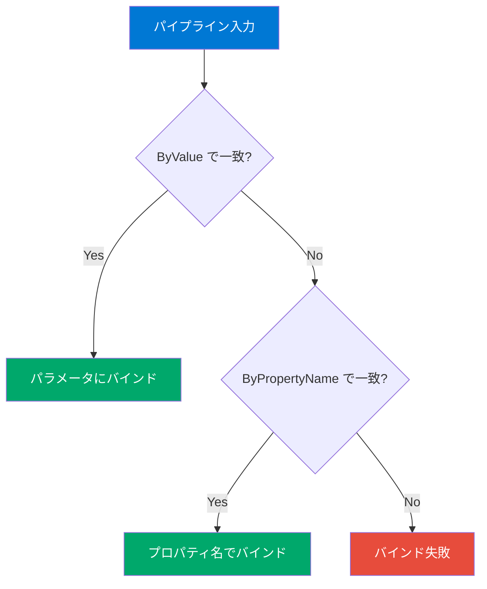

## パイプラインとは

パイプライン（`|`）は、あるコマンドの**出力**を次のコマンドの**入力**として渡す仕組みです。PowerShellのパイプラインが他のシェルと根本的に異なるのは、**テキストではなくオブジェクト**が流れることです。


### オブジェクトパイプラインの利点

```powershell
# テキストパイプライン（bash）の問題点
# メモリを100MB以上使うプロセスを検索する場合:
# ps aux | awk '{if ($6 > 102400) print $11, $6}'
# → 列番号を覚える必要がある
# → テキストのパースはエラーが起きやすい

# オブジェクトパイプライン（PowerShell）
Get-Process |
    Where-Object { $_.WorkingSet64 -gt 100MB } |
    Select-Object Name, @{N='Memory(MB)'; E={[math]::Round($_.WorkingSet64/1MB, 2)}}
# → プロパティ名でアクセスするので明確
# → 型情報が保持されるので数値比較が正確
```

## $_ と $PSItem

パイプラインの中で現在処理中のオブジェクトを参照するには、`$_` または `$PSItem` を使います。どちらも同じものです。

```powershell
# $_ で現在のオブジェクトにアクセス
Get-Process | Where-Object { $_.CPU -gt 10 }

# $PSItem でも同じ（PowerShell 3.0+）
Get-Process | Where-Object { $PSItem.CPU -gt 10 }

# プロパティへのアクセス
Get-Process | ForEach-Object { "$($_.Name): $($_.CPU)" }
```

## パイプラインパラメータバインディング

パイプラインからのオブジェクトは、次のコマンドのパラメータに**自動的にバインド**されます。バインディングには2つの方法があります：



### ByValue（型による一致）

パイプラインオブジェクトの**型**がパラメータの受け入れ型と一致する場合にバインドされます。

```powershell
# "pwsh" という文字列が -Name パラメータに ByValue でバインドされる
"pwsh" | Get-Process

# Get-Help で ByValue パラメータを確認
Get-Help Get-Process -Parameter Name
# Accept pipeline input? True (ByValue)
```

### ByPropertyName（プロパティ名による一致）

パイプラインオブジェクトの**プロパティ名**がパラメータ名と一致する場合にバインドされます。

```powershell
# CSVからプロパティ名で自動バインド
# processes.csv: Name
# pwsh
Import-Csv ./processes.csv | Get-Process

# カスタムオブジェクトのプロパティ名でバインド
[PSCustomObject]@{
    Path = "/tmp"
    Destination = "/tmp/backup"
} | Copy-Item -WhatIf
```

### バインディングの確認方法

```powershell
# Trace-Command でバインディングの過程を確認
Trace-Command -Name ParameterBinding -Expression {
    "pwsh" | Get-Process
} -PSHost
```

## パイプラインの実践パターン

### パターン1: フィルタ → ソート → 選択

```powershell
# CPU使用率の高いプロセストップ10
Get-Process |
    Where-Object { $_.CPU -gt 0 } |
    Sort-Object CPU -Descending |
    Select-Object -First 10 Name, CPU, Id
```

### パターン2: 一括処理

```powershell
# テキストファイルの一括変換
Get-ChildItem *.txt |
    ForEach-Object {
        $newName = $_.BaseName + ".md"
        Rename-Item $_.FullName -NewName $newName -WhatIf
    }
```

### パターン3: 集計・分析

```powershell
# ファイルの拡張子別集計
Get-ChildItem -Recurse -File |
    Group-Object Extension |
    Sort-Object Count -Descending |
    Select-Object -First 10 Name, Count, @{
        N='TotalSize(KB)'; E={[math]::Round(($_.Group | Measure-Object Length -Sum).Sum/1KB, 2)}
    }
```

### パターン4: 変換・エクスポート

```powershell
# プロセス情報をJSONに変換
Get-Process | Select-Object Name, Id, CPU |
    ConvertTo-Json |
    Out-File ./processes.json
```

## パイプライン vs 変数経由の比較

```powershell
# パイプライン方式（ストリーミング・メモリ効率が良い）
Get-Process | Where-Object { $_.CPU -gt 10 } | Sort-Object CPU

# 変数経由方式（全結果をメモリに保持）
$allProcesses = Get-Process
$filtered = $allProcesses | Where-Object { $_.CPU -gt 10 }
$sorted = $filtered | Sort-Object CPU
$sorted
```

> **使い分けガイド:** 単純な処理チェーンはパイプラインで、結果を複数回使う場合や条件分岐が必要な場合は変数経由で。

## まとめ

| ポイント | 内容 |
|---|---|
| パイプライン | `|` でコマンドの出力を次の入力に渡す |
| オブジェクトベース | テキストではなく.NETオブジェクトが流れる |
| `$_` / `$PSItem` | 現在処理中のオブジェクトの参照 |
| バインディング | ByValue（型一致）→ ByPropertyName（名前一致）の順 |
| ストリーミング | 1オブジェクトずつ逐次処理（メモリ効率が良い） |

## ハンズオン課題

```powershell
# 1. CPUを使用中のプロセスの件数を数える
Get-Process | Where-Object { $_.CPU -gt 0 } | Measure-Object

# 2. 環境変数をアルファベット順に表示
Get-ChildItem Env: | Sort-Object Name | Format-Table Name, Value

# 3. ホームディレクトリの .md ファイルを検索
Get-ChildItem ~ -Filter "*.md" -Recurse -ErrorAction SilentlyContinue |
    Select-Object FullName, Length, LastWriteTime

# 4. パイプラインバインディングを確認
Get-Help Stop-Process -Parameter Name
# "Accept pipeline input?" を確認する
```
