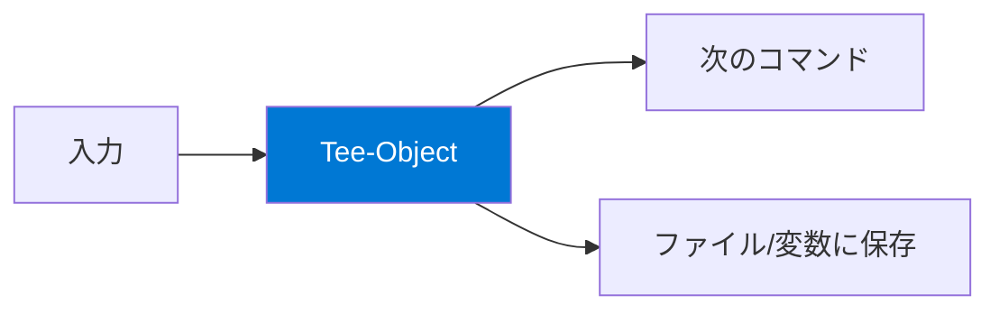

## Group-Object — グループ化

`Group-Object`（エイリアス: `group`）は、指定したプロパティの値でオブジェクトをグループ化します。

```powershell
# サービスを状態別にグループ化
Get-Service | Group-Object Status

# ファイルを拡張子別にグループ化
Get-ChildItem -File | Group-Object Extension

# プロセスを名前でグループ化（同名プロセスの個数がわかる）
Get-Process | Group-Object Name | Sort-Object Count -Descending | Select-Object -First 10

# ハッシュテーブルとして取得（高速な検索が可能）
$grouped = Get-Service | Group-Object Status -AsHashTable
$grouped['Running']   # 実行中のサービス一覧
$grouped['Stopped']   # 停止中のサービス一覧

# 文字列化されたキー
$grouped = Get-Service | Group-Object Status -AsHashTable -AsString
```

### カスタムグループ化

```powershell
# ファイルサイズでカテゴリ分け
Get-ChildItem -File -Recurse -ErrorAction SilentlyContinue | Group-Object {
    if ($_.Length -lt 1KB) { "Tiny (<1KB)" }
    elseif ($_.Length -lt 1MB) { "Small (<1MB)" }
    elseif ($_.Length -lt 100MB) { "Medium (<100MB)" }
    else { "Large (100MB+)" }
} | Select-Object Name, Count | Sort-Object Count -Descending

# 日付でグループ化（月別）
Get-ChildItem -File | Group-Object { $_.LastWriteTime.ToString("yyyy-MM") }
```

## Measure-Object — 集計

`Measure-Object`（エイリアス: `measure`）は、オブジェクトの件数や数値プロパティの合計・平均・最大・最小を計算します。

```powershell
# 件数の計測
Get-Process | Measure-Object
Get-Service | Where-Object Status -eq Running | Measure-Object

# 数値プロパティの集計
Get-Process | Measure-Object CPU -Sum -Average -Maximum -Minimum

# ファイルサイズの集計
Get-ChildItem -File | Measure-Object Length -Sum -Average
# → Sum（合計バイト数）, Average（平均バイト数）

# テキストの文字数・単語数・行数
Get-Content ./README.md | Measure-Object -Character -Word -Line
```

### 集計結果の活用

```powershell
# 合計値だけ取得
$totalSize = (Get-ChildItem -File | Measure-Object Length -Sum).Sum
"合計サイズ: $([math]::Round($totalSize / 1MB, 2)) MB"

# 件数だけ取得
$count = (Get-Process | Measure-Object).Count
"実行中プロセス: $count 個"
```

## Compare-Object — 比較

`Compare-Object`（エイリアス: `compare`, `diff`）は、2つのオブジェクトセットを比較して差分を表示します。

```powershell
# 2つの配列の比較
$a = 1, 2, 3, 4, 5
$b = 3, 4, 5, 6, 7

Compare-Object $a $b
# => (<=)は$aにのみ存在、(=>)は$bにのみ存在

# ファイル内容の比較
$file1 = Get-Content ./file1.txt
$file2 = Get-Content ./file2.txt
Compare-Object $file1 $file2

# ディレクトリ内容の比較
$dir1 = Get-ChildItem ./folder1 | Select-Object -ExpandProperty Name
$dir2 = Get-ChildItem ./folder2 | Select-Object -ExpandProperty Name
Compare-Object $dir1 $dir2

# 共通要素も含めて表示
Compare-Object $a $b -IncludeEqual

# 特定のプロパティで比較
$before = Get-Service
# ... 何か変更を加える ...
$after = Get-Service
Compare-Object $before $after -Property Status
```

| SideIndicator | 意味 |
|---|---|
| `<=` | ReferenceObject（第1引数）にのみ存在 |
| `=>` | DifferenceObject（第2引数）にのみ存在 |
| `==` | 両方に存在（`-IncludeEqual` 指定時） |

## Tee-Object — 出力の分岐

`Tee-Object`（エイリアス: `tee`）は、パイプラインの出力を**ファイルまたは変数に保存しつつ、次のコマンドにも渡す**コマンドレットです。



```powershell
# 変数に保存しつつパイプライン継続
Get-Process | Tee-Object -Variable allProcs | Where-Object CPU -gt 10
# $allProcs には全プロセスが、パイプには CPU > 10 のみ流れる

# ファイルに保存しつつ画面にも表示
Get-Service | Tee-Object -FilePath ./services.txt | Where-Object Status -eq Running

# 追記モード
Get-Process | Tee-Object -FilePath ./log.txt -Append
```

## 実践例: 総合パイプライン

```powershell
# ディレクトリの詳細分析レポート
Get-ChildItem -Recurse -File -ErrorAction SilentlyContinue |
    Tee-Object -Variable allFiles |       # 全ファイルを変数に保存
    Group-Object Extension |               # 拡張子別にグループ化
    Sort-Object Count -Descending |        # 件数でソート
    Select-Object -First 10 Name, Count, @{
        N='TotalMB'
        E={[math]::Round(($_.Group | Measure-Object Length -Sum).Sum / 1MB, 2)}
    } | Format-Table -AutoSize

# 全ファイルの総計
$stats = $allFiles | Measure-Object Length -Sum -Average
"総ファイル数: $($stats.Count), 合計: $([math]::Round($stats.Sum/1MB,2))MB"
```

## まとめ

| コマンドレット | 用途 | 代表的な使い方 |
|---|---|---|
| `Group-Object` | グループ化 | `\| group Extension` |
| `Measure-Object` | 集計 | `\| measure Length -Sum -Average` |
| `Compare-Object` | 差分比較 | `Compare-Object $a $b` |
| `Tee-Object` | 出力の分岐保存 | `\| tee -Variable result` |

## ハンズオン課題

```powershell
# 1. プロセスを会社名（Company）でグループ化し、多い順に表示
Get-Process | Where-Object Company |
    Group-Object Company | Sort-Object Count -Descending | Select-Object -First 10

# 2. /tmp の全ファイルの統計情報（件数・合計サイズ・平均サイズ）
Get-ChildItem /tmp -File -Recurse -ErrorAction SilentlyContinue |
    Measure-Object Length -Sum -Average -Maximum

# 3. 2つのフォルダ内のファイル名を比較（差分を確認）
# mkdir /tmp/demo-a /tmp/demo-b
# New-Item /tmp/demo-a/file1.txt, /tmp/demo-a/file2.txt, /tmp/demo-b/file2.txt, /tmp/demo-b/file3.txt
# Compare-Object (ls /tmp/demo-a).Name (ls /tmp/demo-b).Name
```
