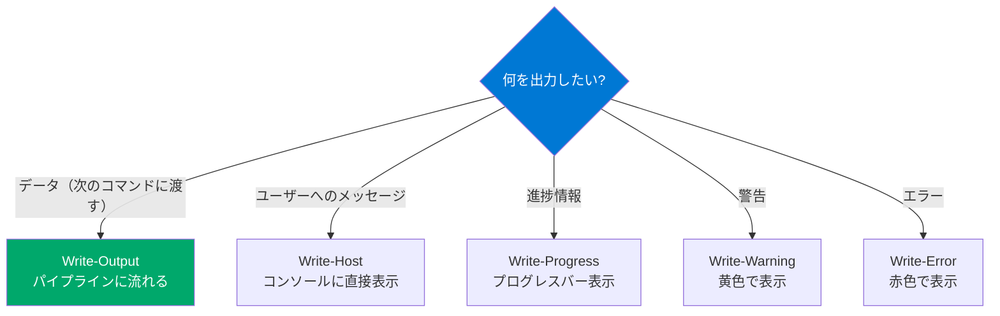

## フォーマットコマンドレット

PowerShellのオブジェクトは、画面に表示される際に**フォーマッタ**によってテキストに変換されます。明示的にフォーマットを指定しないと、PowerShellがオブジェクトの型に応じて自動でフォーマットを選択します。

### Format-Table（ft）— 表形式

```powershell
# 基本的な表形式
Get-Process | Format-Table

# プロパティを選択して表示
Get-Process | Format-Table Name, CPU, Id -AutoSize

# 列幅の自動調整
Get-Service | Format-Table -AutoSize

# 折り返し表示
Get-Process | Format-Table -Wrap

# カスタム列の定義
Get-Process | Format-Table Name,
    @{Label='CPU(s)'; Expression={[math]::Round($_.CPU, 2)}; Align='Right'},
    @{Label='Mem(MB)'; Expression={[math]::Round($_.WorkingSet64/1MB)}; Align='Right'} -AutoSize

# グループ化して表示
Get-Service | Sort-Object Status | Format-Table -GroupBy Status
```

### Format-List（fl）— リスト形式

プロパティが多い場合や詳細情報を見たい場合に適しています。

```powershell
# 全プロパティをリスト形式で表示
Get-Process pwsh | Format-List *

# 特定のプロパティだけ
Get-Service | Select-Object -First 3 | Format-List Name, Status, DisplayName, StartType
```

### Format-Wide（fw）— ワイド形式

1つのプロパティだけを列形式で表示します。

```powershell
# プロセス名を2列で表示
Get-Process | Format-Wide Name -Column 3
```

> **重要:** `Format-*` コマンドレットはパイプラインの**最後**で使います。フォーマット後のオブジェクトは表示用のオブジェクトに変換されるため、後続のパイプライン処理には使えません。

## 出力先の指定

### Out-File — ファイルへの出力

```powershell
# ファイルに出力
Get-Process | Out-File ./processes.txt

# 追記モード
Get-Process pwsh | Out-File ./processes.txt -Append

# エンコーディング指定
Get-Process | Out-File ./processes.txt -Encoding utf8

# リダイレクト演算子でも同じ
Get-Process > ./processes.txt    # 上書き
Get-Process >> ./processes.txt   # 追記
```

### Export-Csv — CSV出力

```powershell
# CSVエクスポート
Get-Process | Select-Object Name, Id, CPU |
    Export-Csv ./processes.csv -NoTypeInformation

# エンコーディング指定
Get-Service | Export-Csv ./services.csv -NoTypeInformation -Encoding UTF8

# CSVの読み込み
$data = Import-Csv ./processes.csv
$data | Format-Table
```

### ConvertTo-Json / ConvertFrom-Json

```powershell
# JSONに変換
Get-Process | Select-Object Name, Id, CPU -First 3 | ConvertTo-Json

# ネストの深さを指定
Get-Process | Select-Object -First 1 | ConvertTo-Json -Depth 3

# JSONファイルの読み書き
$config = @{
    Server = "localhost"
    Port = 8080
    Debug = $true
}
$config | ConvertTo-Json | Out-File ./config.json
$loaded = Get-Content ./config.json | ConvertFrom-Json
$loaded.Server  # "localhost"
```

### ConvertTo-Xml / ConvertTo-Html

```powershell
# HTML形式で出力
Get-Service | Select-Object Name, Status |
    ConvertTo-Html -Title "サービス一覧" |
    Out-File ./services.html

# XMLに変換
Get-Process | Select-Object Name, Id -First 5 | ConvertTo-Xml
```

## Out-GridView（Windows限定）

`Out-GridView` はGUIのグリッドビューで結果を表示し、フィルタリングや選択が可能です。

```powershell
# グリッドビューで表示
Get-Process | Out-GridView

# 選択モード（選択した項目をパイプに返す）
Get-Process | Out-GridView -PassThru | Stop-Process -WhatIf

# タイトル付き
Get-Service | Out-GridView -Title "サービス一覧"
```

## Out-Null — 出力の破棄

```powershell
# 出力を破棄する方法
Get-Process | Out-Null                    # Out-Null
$null = Get-Process                       # $null代入（最速）
Get-Process > $null                       # リダイレクト
[void](Get-Process)                       # [void]キャスト
```

## Write系コマンドレットの使い分け



```powershell
# Write-Output — パイプラインに流れる
Write-Output "これはパイプに流れる" | Measure-Object  # Count: 1

# Write-Host — パイプに流れない
Write-Host "これは画面だけ" | Measure-Object  # Count: 0

# Write-Progress — プログレスバー
$items = 1..100
for ($i = 0; $i -lt $items.Count; $i++) {
    Write-Progress -Activity "処理中" -Status "$i / $($items.Count)" -PercentComplete ($i / $items.Count * 100)
    Start-Sleep -Milliseconds 50
}
```

## まとめ

| コマンド | 用途 |
|---|---|
| `Format-Table` | 表形式で表示（パイプの最後で使用） |
| `Format-List` | リスト形式で全プロパティ表示 |
| `Out-File` / `>` | ファイルへのテキスト出力 |
| `Export-Csv` | 構造化データのCSV出力 |
| `ConvertTo-Json` | JSON形式への変換 |
| `Write-Output` | パイプラインへのデータ出力 |
| `Write-Host` | コンソール直接表示（パイプに流れない） |

## ハンズオン課題

```powershell
# 1. プロセス一覧をCSVファイルに出力して、読み戻す
Get-Process | Select-Object Name, Id, CPU | Export-Csv /tmp/ps-procs.csv -NoTypeInformation
Import-Csv /tmp/ps-procs.csv | Select-Object -First 5

# 2. サービス一覧をJSON形式でファイルに保存
Get-Service | Select-Object Name, Status | ConvertTo-Json | Out-File /tmp/services.json
Get-Content /tmp/services.json | ConvertFrom-Json | Select-Object -First 3

# 3. Format-Table のカスタム列で見やすいプロセスレポートを作成
Get-Process | Sort-Object WorkingSet64 -Descending | Select-Object -First 10 |
    Format-Table Name,
        @{L='CPU(s)'; E={'{0:N2}' -f $_.CPU}; A='Right'},
        @{L='Mem(MB)'; E={[math]::Round($_.WorkingSet64/1MB)}; A='Right'} -AutoSize
```
