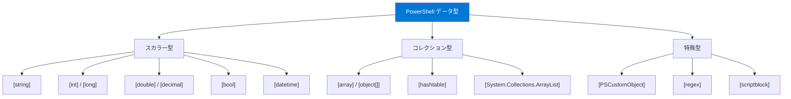

## 変数の基本

PowerShellの変数は `$` プレフィックスで始まります。明示的な宣言は不要で、代入時に自動的に作成されます。

```powershell
# 変数の代入
$name = "PowerShell"
$version = 7
$isActive = $true
$today = Get-Date

# 変数の参照
Write-Host "名前: $name, バージョン: $version"

# 変数の型を確認
$name.GetType().Name       # String
$version.GetType().Name    # Int32
$isActive.GetType().Name   # Boolean
```

### 変数の命名規則

```powershell
# 有効な変数名
$myVariable = "OK"
$my_variable = "OK"
$MyVariable123 = "OK"

# 特殊文字を含む変数名（中括弧で囲む）
${my-variable} = "ハイフン入り"
${my variable} = "スペース入り"
${C:\path\to\file} = "パス"
```

### 型の強制（型制約）

```powershell
# 型を明示的に指定
[string]$name = "Hello"
[int]$count = 42
[double]$pi = 3.14159
[bool]$flag = $true
[datetime]$date = "2025-01-01"

# 型制約付き変数は、型が異なる値を代入すると自動変換される
[int]$num = "42"        # 文字列→整数に自動変換
$num.GetType().Name     # Int32

# 変換できない場合はエラー
[int]$num = "hello"     # エラー！
```

## 主要なデータ型



| 型 | .NET型 | リテラル例 | 説明 |
|---|---|---|---|
| `[string]` | System.String | `"Hello"`, `'Hello'` | 文字列 |
| `[int]` | System.Int32 | `42` | 32ビット整数 |
| `[long]` | System.Int64 | `42L` | 64ビット整数 |
| `[double]` | System.Double | `3.14` | 倍精度浮動小数点 |
| `[decimal]` | System.Decimal | `3.14d` | 高精度小数 |
| `[bool]` | System.Boolean | `$true`, `$false` | 論理値 |
| `[datetime]` | System.DateTime | `Get-Date` | 日付と時刻 |
| `[char]` | System.Char | `[char]'A'` | 単一文字 |
| `[byte]` | System.Byte | `[byte]255` | バイト値（0-255） |

### サイズリテラル

PowerShellにはファイルサイズ用の便利なリテラルがあります：

```powershell
1KB   # 1024
1MB   # 1048576
1GB   # 1073741824
1TB   # 1099511627776

# 使用例
Get-ChildItem | Where-Object { $_.Length -gt 10MB }
```

## 自動変数

PowerShellには多数の**自動変数**（システムが自動で設定する変数）があります。

| 変数 | 説明 |
|---|---|
| `$true` / `$false` | 論理値のTrue/False |
| `$null` | Null値 |
| `$_` / `$PSItem` | パイプライン内の現在のオブジェクト |
| `$PSVersionTable` | PowerShellのバージョン情報 |
| `$HOME` | ユーザーのホームディレクトリ |
| `$PWD` | 現在のディレクトリ |
| `$Host` | ホストアプリケーション情報 |
| `$PID` | PowerShellプロセスのID |
| `$IsLinux` | Linux上で実行中か |
| `$IsMacOS` | macOS上で実行中か |
| `$IsWindows` | Windows上で実行中か |
| `$Error` | エラーオブジェクトの配列 |
| `$LASTEXITCODE` | 直前の外部コマンドの終了コード |
| `$?` | 直前のコマンドが成功したか |
| `$args` | 関数/スクリプトに渡された引数の配列 |
| `$Matches` | `-match` 演算子のマッチ結果 |
| `$PSScriptRoot` | スクリプトファイルのディレクトリ |

```powershell
# 自動変数の確認
$PSVersionTable.PSVersion
$HOME
$PWD
$PID
$IsLinux  # Linux上なら True

# プラットフォーム判定
if ($IsLinux) { "Linux です" }
elseif ($IsMacOS) { "macOS です" }
elseif ($IsWindows) { "Windows です" }
```

## 変数の管理

```powershell
# 変数の一覧
Get-Variable

# 変数の検索
Get-Variable -Name PS*

# 変数がnullかチェック
$x = $null
$null -eq $x    # True
$x -eq $null    # True（順序に注意：コレクション比較になる場合がある）

# 変数の削除
Remove-Variable -Name x

# 変数のスコープ
$global:myVar = "グローバル変数"
$script:myVar = "スクリプトスコープ変数"
$local:myVar  = "ローカル変数"
$private:myVar = "プライベート変数"
```

## 型変換

```powershell
# 明示的キャスト
[int]"42"              # 文字列→整数
[string]42             # 整数→文字列
[double]"3.14"         # 文字列→小数
[datetime]"2025-01-01" # 文字列→日付
[bool]1                # 整数→論理値（1=True, 0=False）
[array]"single"        # スカラー→単一要素の配列

# -as 演算子（変換失敗時に $null を返す、エラーにならない）
"42" -as [int]         # 42
"hello" -as [int]      # $null（変換失敗）

# -is 演算子（型の判定）
42 -is [int]           # True
"hello" -is [string]   # True
$null -is [object]     # False
```

## まとめ

| ポイント | 内容 |
|---|---|
| 変数宣言 | `$` プレフィックス、暗黙的型付け |
| 型制約 | `[int]$x = 42` で型を強制 |
| 自動変数 | `$_`, `$true`, `$null`, `$HOME`, `$IsLinux` 等 |
| 型変換 | キャスト `[int]"42"` / `-as` 演算子 / `-is` 判定 |
| サイズリテラル | `1KB`, `1MB`, `1GB`, `1TB` |

## ハンズオン課題

```powershell
# 1. 各型の変数を作成し、GetType()で型名を確認
$str = "テスト"; $str.GetType().Name
$num = 42; $num.GetType().Name
$dec = 3.14; $dec.GetType().Name
$bool = $true; $bool.GetType().Name
$date = Get-Date; $date.GetType().Name

# 2. プラットフォーム判定
"OS: $(if($IsLinux){'Linux'}elseif($IsMacOS){'macOS'}else{'Windows'})"

# 3. -as 演算子で安全な型変換
"100" -as [int]    # 100
"abc" -as [int]    # $null

# 4. 主要な自動変数の値を確認
$PSVersionTable.PSVersion
$HOME
$PID
$PWD
```
