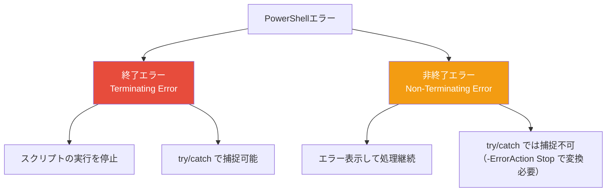

## PowerShellのエラー体系

PowerShellのエラーは**2種類**に分かれます。この区別の理解が、エラー処理の第一歩です。



| 種類 | 動作 | 例 | try/catch |
|---|---|---|:---:|
| **終了エラー** | 処理を停止 | 構文エラー、`throw`、.NET例外 | ✅ |
| **非終了エラー** | デフォルトで処理続行 | ファイル未検出、権限エラー | ❌（変換必要） |

```powershell
# 非終了エラー（処理が継続する）
Get-Item "存在しない.txt"   # エラー表示されるが次の行も実行される
Write-Host "この行は実行される"

# 終了エラー
throw "致命的エラー"        # ここで停止
Write-Host "この行は実行されない"
```

## $Error 自動変数

`$Error` は、セッション中に発生した**全エラーを記録**する配列です。

```powershell
# 直前のエラー
$Error[0]

# エラーの詳細情報
$Error[0].Exception.Message   # エラーメッセージ
$Error[0].InvocationInfo       # 発生箇所の情報
$Error[0].ScriptStackTrace     # スタックトレース

# エラー履歴のクリア
$Error.Clear()

# エラーの総数
$Error.Count
```

## ErrorRecord オブジェクト

すべてのエラーは `ErrorRecord` オブジェクトとして記録されます。

```powershell
# ErrorRecord の主要プロパティ
try {
    Get-Item "nonexistent" -ErrorAction Stop
} catch {
    $err = $_
    "例外型: $($err.Exception.GetType().Name)"
    "メッセージ: $($err.Exception.Message)"
    "カテゴリ: $($err.CategoryInfo.Category)"
    "対象: $($err.TargetObject)"
    "コマンド: $($err.InvocationInfo.MyCommand)"
}
```

## ハンズオン課題

```powershell
# 1. 意図的にエラーを発生させて$Errorを確認
$Error.Clear()
Get-Item "file1.txt" -ErrorAction SilentlyContinue
Get-Item "file2.txt" -ErrorAction SilentlyContinue
$Error.Count
$Error[0].Exception.Message
$Error[1].Exception.Message
```
