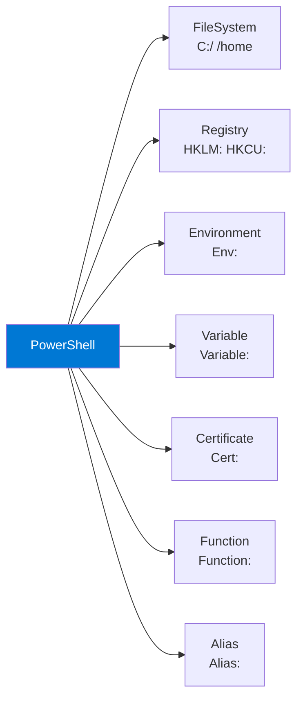

## プロバイダーとは

PowerShellプロバイダーは、ファイルシステムのように一貫した方法で**さまざまなデータストアにアクセス**する仕組みです。



```powershell
# プロバイダー一覧
Get-PSProvider

# ドライブ一覧
Get-PSDrive

# 全プロバイダーで同じコマンドが使える
Get-ChildItem C:\          # ファイルシステム
Get-ChildItem Env:         # 環境変数
Get-ChildItem Variable:    # 変数
Get-ChildItem Function:    # 関数
Get-ChildItem Alias:       # エイリアス
```

## 環境変数プロバイダー

```powershell
# 環境変数の一覧
Get-ChildItem Env:

# 特定の環境変数
$env:HOME
$env:PATH
$env:USER

# 環境変数の設定
$env:MY_APP_ENV = "development"

# 環境変数の削除
Remove-Item Env:MY_APP_ENV

# 環境変数のフィルタリング
Get-ChildItem Env: | Where-Object Name -like "PS*"
```

## 変数プロバイダー

```powershell
# 変数の一覧
Get-ChildItem Variable:

# 自動変数を確認
Get-ChildItem Variable: | Where-Object { $_.Options -match "ReadOnly" }
```

## レジストリプロバイダー（Windows）

> [!WARNING]
> レジストリプロバイダー（`HKLM:`, `HKCU:`）と証明書プロバイダー（`Cert:`）は **Windows専用** です。Linux/macOSでは利用できません。

```powershell
# レジストリの参照（Windowsのみ）
Get-ChildItem HKLM:\SOFTWARE
Get-ChildItem HKCU:\SOFTWARE

# レジストリ値の取得
Get-ItemProperty HKLM:\SOFTWARE\Microsoft\Windows\CurrentVersion -Name ProgramFilesDir

# カスタムPSDriveの作成
New-PSDrive -Name MyReg -PSProvider Registry -Root HKLM:\SOFTWARE\MyApp
Get-ChildItem MyReg:
Remove-PSDrive MyReg
```

## カスタムPSDrive

```powershell
# ファイルシステムのショートカットドライブ
New-PSDrive -Name Projects -PSProvider FileSystem -Root ~/projects
Set-Location Projects:
Get-ChildItem Projects:
Remove-PSDrive Projects

# 一時的なドライブ（スクリプト内で便利）
New-PSDrive -Name Logs -PSProvider FileSystem -Root /var/log -Scope Script
```

## まとめ

| ポイント | 内容 |
|---|---|
| プロバイダー | さまざまなデータストアにファイルシステム風にアクセス |
| `Env:` | 環境変数の参照・設定 |
| `Variable:` / `Function:` / `Alias:` | PowerShell内部のデータストア |
| `New-PSDrive` | カスタムドライブでショートカット作成 |
| Registry / Certificate | **Windows専用**プロバイダー |

## ハンズオン課題

```powershell
# 1. 全プロバイダーとドライブを確認
Get-PSProvider | Format-Table Name, Drives
Get-PSDrive | Format-Table Name, Provider, Root -AutoSize

# 2. 環境変数で「PATH」系を探す
Get-ChildItem Env: | Where-Object Name -like "*PATH*"

# 3. Function:ドライブでprompt関数を確認
Get-ChildItem Function:prompt
```
