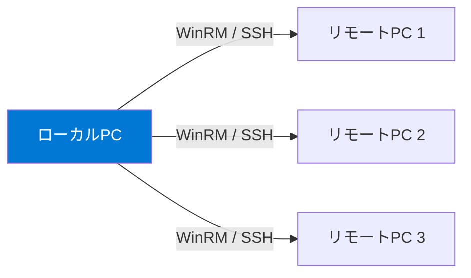

## リモート処理の基本

PowerShellリモーティングにより、別のコンピュータ上でコマンドを実行できます。



### Invoke-Command

```powershell
# リモートコンピュータでコマンド実行
Invoke-Command -ComputerName Server01 -ScriptBlock {
    Get-Process | Select-Object -First 5 Name, CPU
}

# 複数コンピュータに同時実行
Invoke-Command -ComputerName Server01, Server02, Server03 -ScriptBlock {
    $env:COMPUTERNAME
    Get-Service -Name sshd | Select-Object Status
}

# SSH経由のリモート実行（クロスプラットフォーム）
Invoke-Command -HostName linux-server -UserName admin -ScriptBlock {
    uname -a
    Get-Process | Measure-Object
}

# ローカル変数をリモートに渡す
$serviceName = "sshd"
Invoke-Command -ComputerName Server01 -ScriptBlock {
    Get-Service -Name $using:serviceName
}
```

### PSSession（永続セッション）

```powershell
# セッションの作成
$session = New-PSSession -ComputerName Server01

# セッション経由でコマンド実行
Invoke-Command -Session $session -ScriptBlock { $x = 42 }
Invoke-Command -Session $session -ScriptBlock { $x }  # 42（変数が保持される）

# 対話式セッション
Enter-PSSession -ComputerName Server01
# [Server01]: PS> Get-Process
# [Server01]: PS> exit
Exit-PSSession

# セッションの切断と再接続
Disconnect-PSSession -Session $session
Connect-PSSession -Session $session

# セッションの削除
Remove-PSSession -Session $session
```

## バックグラウンドジョブ

```powershell
# ジョブの開始
$job = Start-Job -ScriptBlock {
    Start-Sleep -Seconds 5
    Get-Process | Select-Object -First 10 Name, CPU
}

# ジョブの状態確認
Get-Job
$job.State  # Running → Completed

# 結果の取得
$result = Receive-Job -Job $job -Wait

# ジョブの削除
Remove-Job -Job $job

# 複数ジョブの並列実行
$jobs = 1..5 | ForEach-Object {
    Start-Job -ScriptBlock {
        param($id)
        Start-Sleep -Seconds (Get-Random -Minimum 1 -Maximum 5)
        "ジョブ $id 完了"
    } -ArgumentList $_
}
$results = $jobs | Wait-Job | Receive-Job
$results
$jobs | Remove-Job
```

## ForEach-Object -Parallel（PowerShell 7+）

```powershell
# 並列処理（最も簡単な方法）
$urls = "https://httpbin.org/delay/1", "https://httpbin.org/delay/1", "https://httpbin.org/delay/1"

# 逐次処理（遅い）
Measure-Command {
    $urls | ForEach-Object { Invoke-RestMethod $_ }
}

# 並列処理（速い）
Measure-Command {
    $urls | ForEach-Object -Parallel {
        Invoke-RestMethod $_
    } -ThrottleLimit 3
}

# 外部変数の参照
$prefix = "結果"
1..10 | ForEach-Object -Parallel {
    "$($using:prefix): $_ の二乗 = $($_ * $_)"
} -ThrottleLimit 5
```

## ThreadJob（軽量ジョブ）

```powershell
# Start-JobよりもThreadJobが軽量で高速
# Install-Module -Name ThreadJob
$job = Start-ThreadJob -ScriptBlock {
    1..100 | ForEach-Object { $_ * $_ }
}
$result = Receive-Job $job -Wait
```

> **⚠️ プラットフォーム注意:** `-ComputerName` パラメータを使うリモート実行は **WinRM（Windows Remote Management）** が必要で、**Windowsのみ**で動作します。Linux/macOS間のリモート実行には `-HostName` パラメータを使った **SSH経由** のリモーティングを使用してください。

## まとめ

| 方法 | 用途 | プラットフォーム |
|---|---|---|
| `Invoke-Command -ComputerName` | WinRMリモート実行 | Windows |
| `Invoke-Command -HostName` | SSHリモート実行 | クロスプラットフォーム |
| `Start-Job` | バックグラウンドジョブ | 全OS |
| `Start-ThreadJob` | 軽量スレッドジョブ | 全OS |
| `ForEach-Object -Parallel` | 最も簡単な並列処理（PS7+） | 全OS |

## ハンズオン課題

```powershell
# 1. ジョブの基本操作（作成→確認→取得→削除）
$job = Start-Job -ScriptBlock { "Hello from background!"; Start-Sleep 2; Get-Date }
Get-Job                       # 状態確認
$job | Wait-Job               # 完了を待つ
Receive-Job $job              # 結果取得
Remove-Job $job               # クリーンアップ

# 2. 並列処理のパフォーマンスを比較
$data = 1..20

Write-Host "=== 逐次処理 ==="
(Measure-Command {
    $data | ForEach-Object {
        Start-Sleep -Milliseconds 200
        $_ * $_
    }
}).TotalSeconds

Write-Host "=== 並列処理 ==="
(Measure-Command {
    $data | ForEach-Object -Parallel {
        Start-Sleep -Milliseconds 200
        $_ * $_
    } -ThrottleLimit 10
}).TotalSeconds
```
