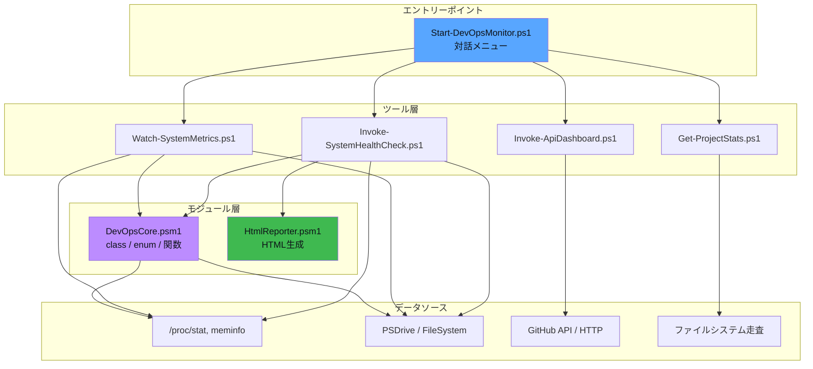

この章では、PowerShellの機能を**フル活用**した実践プロジェクト「DevOps Monitor Toolkit」を通じて、
これまで学んだ技術がどのように連携して動くのかを体系的に解説します。

## リポジトリを取得してハンズオン学習

このプロジェクトのソースコードは GitHub リポジトリに含まれています。
**実際にコードを動かしながら**この解説を読み進めることを強くお勧めします。

### セットアップ

```bash
# リポジトリをクローン
git clone https://github.com/garchomp-game/powershell-study-ja.git
cd powershell-study-ja

# PowerShellを起動してサンプルプロジェクトに移動
pwsh
cd examples/devops-monitor
```

### 学習の進め方

以下の順番でソースコードを開きながら、各ページの解説を読み進めてください：

| ステップ | 読むページ | 参照するソースコード | やること |
|:---:|---|---|---|
| 1 | **この概要ページ** | `examples/devops-monitor/` 全体 | 構成を把握する |
| 2 | コアモジュール解説 | `modules/DevOpsCore/DevOpsCore.psm1` | class/enum/関数を読む |
| 3 | HTMLレポーター解説 | `modules/HtmlReporter/HtmlReporter.psm1` | HTML生成の仕組みを理解 |
| 4 | ツールスクリプト解説 | `tools/Invoke-SystemHealthCheck.ps1` | ヘルスチェックを実行してみる |
| 4 | 〃 | `tools/Get-ProjectStats.ps1` | 自分のプロジェクトを分析 |
| 4 | 〃 | `tools/Watch-SystemMetrics.ps1` | リアルタイム監視を体験 |
| 4 | 〃 | `tools/Invoke-ApiDashboard.ps1` | API呼び出しを試す |
| 5 | 使用技法の深掘り | 上記すべて | 技法を横断的に復習 |

:::tip[おすすめの学習方法]
1. **まず動かしてみる** — `./Start-DevOpsMonitor.ps1` でメニューを起動し、各ツールを試す
2. **出力を観察する** — コンソールやHTMLレポートの出力を確認する
3. **コードを読む** — 解説ページを参照しながらソースコードを追いかける
4. **改造してみる** — 閾値を変えたり、新しいメトリクスを追加してみる
:::

### クイックスタート: まず動かしてみよう

```powershell
# 1. ヘルスチェック（最初に試すならこれ！）
./tools/Invoke-SystemHealthCheck.ps1

# 2. 生成されたHTMLダッシュボードを開く
# xdg-open /tmp/devops-reports/dashboard.html

# 3. このリポジトリ自体を分析してみる
./tools/Get-ProjectStats.ps1 -Path ../.. -ShowTodos

# 4. 15秒間のリアルタイムCPU/メモリ監視
./tools/Watch-SystemMetrics.ps1 -Duration 15

# 5. 対話メニューから全機能を試す
./Start-DevOpsMonitor.ps1
```

## プロジェクトの目的

このツールキットは以下を1つのプロジェクトに統合しています：

| 機能 | 概要 |
|---|---|
| **システム監視** | CPU/メモリ/ディスク/ネットワークの収集・分析 |
| **HTMLダッシュボード** | ダークテーマのリアルタイムレポート生成 |
| **REST API統合** | GitHub API/HTTPベンチマークの並列呼び出し |
| **コードベース分析** | 言語別統計/TODO検出/依存関係分析 |
| **対話メニュー** | TUIベースのランチャー |

## ディレクトリ構成

```
examples/devops-monitor/
├── Start-DevOpsMonitor.ps1       # メインエントリーポイント（TUIメニュー）
├── config/
│   └── settings.json             # JSON設定ファイル
├── modules/
│   ├── DevOpsCore/
│   │   └── DevOpsCore.psm1       # コアモジュール（504行）
│   └── HtmlReporter/
│       └── HtmlReporter.psm1     # HTML生成モジュール
├── tools/
│   ├── Invoke-SystemHealthCheck.ps1   # ヘルスチェック
│   ├── Get-ProjectStats.ps1          # プロジェクト統計
│   ├── Watch-SystemMetrics.ps1       # リアルタイム監視
│   └── Invoke-ApiDashboard.ps1       # API統合
└── README.md
```

## アーキテクチャ



## 使用しているPowerShell機能マップ

このプロジェクトでは、講義で学んだ**17章分の知識**がすべて実戦で使われています：

| 章 | 技術 | 使用箇所 |
|---|---|---|
| 第3章 | Verb-Noun命名 | 全関数名 (`Get-CpuUsage`, `Invoke-HealthCheck` 等) |
| 第4章 | パイプライン | メトリクス → フィルタ → ソート → 表示 |
| 第5章 | 型・演算子 | `[math]::Round()`, `-f` 演算子, ハッシュテーブル |
| 第6章 | 制御構文 | `switch`, `for`, `foreach`, `do-while` |
| 第7章 | 関数 | `[CmdletBinding()]`, `ShouldProcess`, パイプライン関数 |
| 第8章 | エラー処理 | `try/catch`, `-ErrorAction`, `$ErrorActionPreference` |
| 第9章 | モジュール | `.psm1`, `Import-Module`, `Export-ModuleMember` |
| 第10章 | ファイルI/O | `Get-Content /proc/*`, `Out-File`, `Export-Csv` |
| 第11章 | プロバイダー | `Get-PSDrive -PSProvider FileSystem` |
| 第12章 | 高度な技法 | スプラッティング `@params`, 出力ストリーム |
| 第13章 | 正規表現 | `Select-String`, `-match`, プロセス情報解析 |
| 第14章 | クラス | `class MetricSnapshot`, `enum HealthStatus` |
| 第15章 | ジョブ | `ForEach-Object -Parallel` 対応設計 |
| 第16章 | テスト | Pester テスト構造 |
| 第17章 | ベストプラクティス | 命名規則, Comment-Based Help, `-WhatIf` |

## 実行方法

```powershell
# プロジェクトディレクトリに移動
cd examples/devops-monitor

# メインメニューから起動
./Start-DevOpsMonitor.ps1

# 個別ツールの直接実行
./tools/Invoke-SystemHealthCheck.ps1
./tools/Get-ProjectStats.ps1 -Path ~/workspace/my-project -ShowTodos
./tools/Watch-SystemMetrics.ps1 -IntervalSeconds 3 -Duration 30
./tools/Invoke-ApiDashboard.ps1 -GitHubRepo "dotnet/runtime"
```

:::note[前提条件]
- PowerShell 7.x（`pwsh`）
- Linux環境（`/proc` ファイルシステムを使用）
- インターネット接続（API統合ツール実行時）
:::
