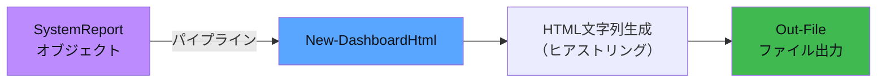

`HtmlReporter.psm1` は、収集したシステムメトリクスを
**ダークテーマのリッチなHTMLダッシュボード**に変換するモジュールです。

## 設計のポイント

PowerShellの「**オブジェクトをフォーマットへ変換**」という基本思想を、
HTML生成に応用しています。



## ShouldProcess 対応

ファイルを生成する関数なので、`-WhatIf` に対応しています：

```powershell
function New-DashboardHtml {
    [CmdletBinding(SupportsShouldProcess)]  # ← これを付ける
    param(
        [Parameter(Mandatory, ValueFromPipeline)]  # パイプラインで受け取れる
        $Report,
        [string]$OutputPath = "/tmp/devops-reports/dashboard.html"
    )

    process {
        # "本当に実行しますか？" の確認（-WhatIf で空実行可能）
        if ($PSCmdlet.ShouldProcess($OutputPath, "HTMLダッシュボード生成")) {
            # 実際の生成処理
        }
    }
}
```

```powershell
# 使い方
$report | New-DashboardHtml                    # 実際に生成
$report | New-DashboardHtml -WhatIf            # シミュレーション
$report | New-DashboardHtml -OutputPath ./my.html   # 出力先を変更
```

## ヒアストリング (@"..."@) によるHTML構築

PowerShellのヒアストリング（Here-String）を使い、HTML全体をテンプレートとして構築しています。

```powershell
$html = @"
<!DOCTYPE html>
<html lang="ja">
<head>
    <meta charset="UTF-8">
    <title>$($Report.ProjectName) — ダッシュボード</title>
    <style>
        /* 変数展開はCSSでも使える */
        body { background: #0d1117; color: #c9d1d9; }
    </style>
</head>
<body>
    <h1>$($Report.Hostname) $(Get-Date -Format 'yyyy-MM-dd')</h1>

    <!-- PowerShellの式を直接埋め込み -->
    $statusBadge

    <!-- ループで生成した行をまとめて挿入 -->
    $($procRows -join "`n")
</body>
</html>
"@
```

:::tip[ヒアストリングのポイント]
- `@"` ... `"@` の展開型（`$変数` が展開される）
- `@'` ... `'@` の非展開型（そのまま出力）
- `"@` は**必ず行頭**に置く必要がある
- `$()` で式を埋め込み可能：`$($Report.Metrics.Count)`
:::

## 動的テーブル行の生成

メトリクスやプロセスの行は、**パイプライン + ForEach-Object** で動的に生成します：

```powershell
# プロセステーブルの行を生成
$procRows = $Report.TopProcesses | ForEach-Object {
    @"
    <tr>
        <td class="mono">$($_.PID)</td>
        <td><strong>$($_.Name)</strong></td>
        <td class="num">$($_.CPU_Sec)</td>
        <td class="num">$($_.MemoryMB)</td>
        <td class="num">$($_.Threads)</td>
    </tr>
"@
}

# 配列を結合してHTMLに埋め込み
$($procRows -join "`n")
```

## ゲージ色の動的切り替え

閾値に応じたCSS変数を返すヘルパー関数：

```powershell
function Get-GaugeColor {
    [CmdletBinding()]
    param(
        [double]$Value, 
        [double]$Warn = 70, 
        [double]$Crit = 90
    )
    if ($Value -ge $Crit) { return 'var(--red)' }    # 90%以上 → 赤
    if ($Value -ge $Warn) { return 'var(--yellow)' }  # 70%以上 → 黄
    return 'var(--green)'                              # 正常 → 緑
}

# HTMLテンプレート内で使用
$cpuColor = Get-GaugeColor -Value $cpuMetric.Value -Warn 70 -Crit 90
# → style="border-color:var(--green)" のように展開される
```

## CSS設計

CSS変数（カスタムプロパティ）で配色を一元管理しています：

```css
:root {
    --bg: #0d1117;       /* 背景 */
    --card: #161b22;     /* カード背景 */
    --border: #21262d;   /* ボーダー */
    --text: #c9d1d9;     /* テキスト */
    --blue: #58a6ff;     /* アクセント */
    --green: #3fb950;    /* 正常 */
    --yellow: #d29922;   /* 警告 */
    --red: #f85149;      /* 危険 */
    --purple: #bc8cff;   /* ハイライト */
}
```

これによりゲージやプログレスバーの色を**PowerShellの変数**で制御できます。

## プログレスバーの実装

ディスク使用率はCSSの `width` を動的に設定してプログレスバーを表示：

```powershell
$diskRows = $Report.DiskUsage | ForEach-Object {
    $barColor = Get-GaugeColor -Value $_.UsedPercent -Warn 85 -Crit 95
    @"
    <td>
        <div class="progress-bar">
            <!-- widthをPS変数で動的設定 -->
            <div class="progress-fill" 
                 style="width:$($_.UsedPercent)%;background:$barColor">
                $($_.UsedPercent)%
            </div>
        </div>
    </td>
"@
}
```

## 出力

生成されたHTMLはブラウザで開けます：

```powershell
# 生成
$report | New-DashboardHtml

# ブラウザで表示（Linux）
xdg-open /tmp/devops-reports/dashboard.html
```
